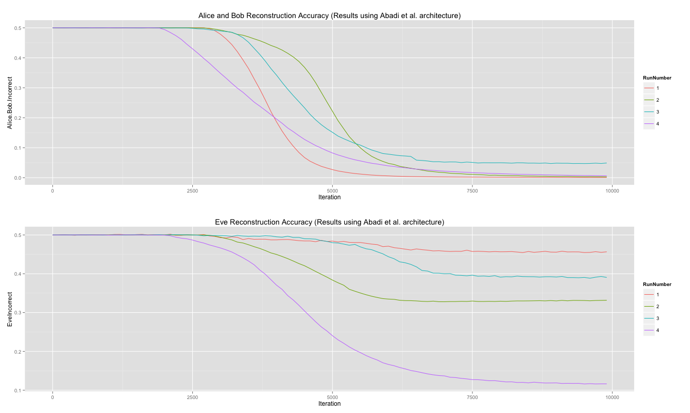

# Adversarial-Neural-Cryptography


-This project is based on the paper <a href="https://openreview.net/pdf?id=S1HEBe_Jl">Learning to Protect Communications with Adversarial Neural Cryptography</a>. The overall concept is that there are two individuals attempting to securely communicate while a third individual attempts to listen Each of the parties previously described is represented by a neural network. The networks attempting to have a private conversation seek to maximize the reconstruction of the original message for the destination network. At the same time, they attempt to minimize the original message's reconstuction by the eavesdropping network. The eavesdropping network's objective is to maximize its reconstruction of the original message. Since these objectives conflict (hence adversarial), the objective becomes harder as the networks become better.


###

The networks are named after the classic scenario used to introduce the concept of cryptography (diagram below):
* Alice is the network sending the secure message.
* Bob is the network that is the intended recipiant for the secure message
* Eve is the network that attempts to evesdrop on the message

</img>


###





* The code achieves the same results as in the paper
  * To Run:
  ```
    1. Clone the repository
    2. python3 Main.py
  ```
      * For additional options:
 ```      python3 Main.py -h    ```
      
* In progress:
 * Exploring additional improvements and use cases
 * Performing analysis on results
 

   
######Dependencies:
```
* Tensorflow 0.12
* Numpy
* Python 3
```
    
